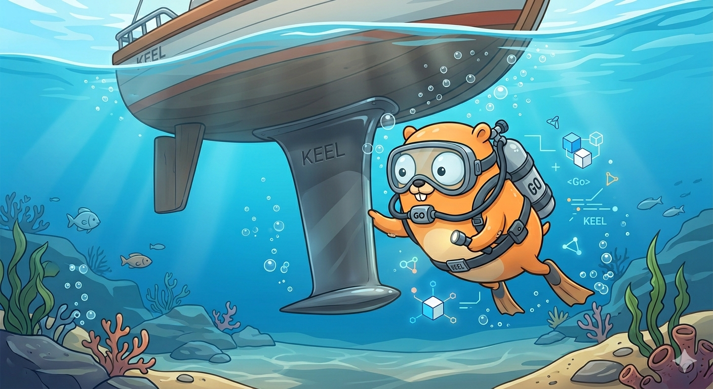

<p align="center">
    <a href="https://github.com/lumm2509/keel" target="_blank" rel="noopener">
        
    </a>
</p>

# keel

An embeddable backend something for Go.

## what this is

- A library that wires together the parts every backend ends up needing: config, storage, jobs, logging, lifecycle, etc.
- Built around a central `App` with a defined lifecycle (`bootstrap → serve → shutdown`)
- Hook-based: extend behavior without rewriting the core
- Importable as a library — not a CLI, not a code generator

## why it exists

Because most Go backends start the same way:

- set up a server
- pick a router
- load config
- connect a database
- add logging
- bolt on jobs/cron
- figure out auth (again)

None of that is hard, but it’s repetitive and easy to get slightly wrong every time.

keel is an attempt to make that part a solved problem.

## origin

This started as “slightly modify PocketBase for a specific use case”.

That stopped being true fairly quickly.

## how it works

You create an `App`, register hooks, and let the runtime handle the rest.

```go
cfg := &config.ConfigModule{
    // your config here
}

a := app.New(cfg)

a.OnServe().Add(func(e *app.ServeEvent[any]) error {
    return nil
})

if err := a.Bootstrap(); err != nil {
    panic(err)
}
```

The important part is not the API surface — it’s that the wiring is already done.

## design notes

**Lifecycle is explicit.**
There is a clear order of execution: bootstrap, serve, shutdown. Hooks attach to those phases. No hidden background behavior.

**The App is the boundary.**
Everything hangs off `App`. It acts as both container and runtime. Not particularly novel, but it keeps things predictable.

**Hooks over inheritance.**
Behavior is extended by registering functions against lifecycle events. No subclassing, no deep hierarchies.

**Structure over enforcement.**
Packages are importable. There’s no `internal/` barrier. Boundaries are implied by layout and usage, not forced by the compiler.

**Opinionated, but escapable.**
There is a “default way” to do things, but you can bypass it if needed. If you can’t, that’s likely a mistake.

## what it is NOT

* Not a full framework in the Rails/Django sense
* Not a replacement for your entire stack
* Not a generator or scaffolding tool
* Not stable — APIs will change

## status

Work in progress.

* Core pieces are in place
* `core/` is being dismantled and redistributed
* Naming and boundaries are still settling
* Some parts are solid, others are in flux

Expect breakage.

## roadmap (loosely)

* stabilize the `App` surface
* make plugins first-class
* clean up dependency direction
* remove remaining `core/` coupling

## final note

This project is mostly a response to repetition.

If you enjoy wiring the same backend from scratch every time, this probably won’t be interesting.

If you don’t, it might be.
